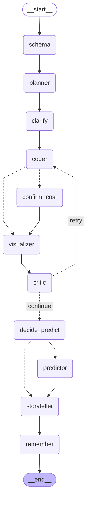

# DataAgent

**A text-to-SQL analytics agent built to be measured.** Ask a question about your data (CSV/Parquet, SQLite, DuckDB, BigQuery); get the SQL that ran, the result, a chart and a short narrative — from a LangGraph pipeline where every change is evaluated with confidence intervals and paired significance tests, every query passes a three-layer guard, and every LLM call is traced with tokens and cost.

**[Live demo](https://ahz003-data-agent.streamlit.app)** · [Docs](docs/index.md) · [Evaluation methodology](benchmarks/README.md) · [System card](docs/system_card.md)

<!-- TODO: demo recording (docs/assets/demo.gif) -->

---

## Scoreboard

Measured numbers only; **pending** rows need a run with a valid Gemini key (commands in [docs/results.md](docs/results.md)).

| Metric | Result |
|---|---|
| Harness correctness: gold SQL through the production path | Spider dev **1034/1034** · Chinook golden set **105/105** · BIRD mini-dev **498/500** (2 gold queries exceed BIRD's 30 s limit) |
| Red team, SQL guard evasion (23 attacks) | **0/23** succeed (original regex guard: 5/23); legitimate queries wrongly blocked 0/8 (was 3/8) |
| Schema-linking recall, all gold columns kept | Spider **97.5%** at k=20 · BIRD **89.6%** at k=30, prompt cut to 61% (offline, BM25) |
| DuckDB vs SQLite, 10M-row group-by | **2,169 ms → 16 ms** (137×) |
| Service overhead under load (stubbed LLM, 1 process) | 0 failures to 200 users; p50 at the model-time floor up to ~100 users; 2 real bottlenecks found and fixed ([performance](docs/performance.md)) |
| Eval sensitivity (power analysis) | n=200 detects ≥6–9 pt paired changes; identical configs differ ≥2 pts 51% of the time ([why](docs/blog/draft-improvements-are-noise.md)) |
| Spider dev EX (repair) · BIRD mini-dev EX (evidence on / off) | **pending** |
| Self-repair lift · retrieval lift (BIRD), with McNemar p | **pending** |
| Chinook golden SQL EX (CI gate baseline) | **pending** |
| Router / fine-tuned 1.5B model on the cost–accuracy frontier | **pending** (needs Gemini Pro, Ollama, a GPU run) |
| Red team, data-borne prompt injection (18 attacks) | **pending** |
| Tests | **284**, ~10 s, no API key |

---

## Architecture

<!-- GRAPH:BEGIN -->

<!-- GRAPH:END -->

The coder writes one read-only SQL query over every table in the workspace, sees its own errors and retries (max 3); the critic runs scipy-backed checks and can send the coder back (bounded; see the [postmortem](docs/postmortems/2026-04-13_eval_findings.md) on the loop this bound prevents). The API adds two human-in-the-loop interrupts: a clarifying question when the planner finds real ambiguity, and a cost confirmation before an expensive BigQuery scan.

| Layer | What it does | Where |
|---|---|---|
| Engines | SQLite, DuckDB (large files), BigQuery (dry-run cost guard) behind one interface | `core/engine.py`, `docs/scale.md` |
| SQL guard | sqlglot AST allow-list + engine-level read-only + timeout; blocks file-reading functions | `core/database.py` |
| Retrieval | hybrid BM25 ⊕ embedding schema linking, value hints, few-shot memory (train only), semantic layer | `retrieval/`, `docs/retrieval.md` |
| Safety | PII masking / local-only mode, injection hardening, numeric faithfulness check, audit log | `core/pii.py`, `core/injection.py`, `docs/system_card.md` |
| Models | Gemini or local Ollama per agent; difficulty router; QLoRA fine-tuning data + notebook | `core/llm.py`, `routing/`, `training/` |
| Observability | JSONL spans with tokens/cost, OTLP export (Langfuse), online eval, drift alerts, feedback loop | `core/tracing.py`, `docs/observability.md` |

## Interfaces

| | |
|---|---|
| Streamlit app | `make run` |
| HTTP API (SSE, multi-turn, interrupts) | `make api` → [docs/api.md](docs/api.md) |
| CLI | `uv run dataagent ask data.csv "top 5 regions by revenue"` |
| MCP server (Claude Desktop, IDEs) | `uv run python mcp_server.py` |

## Evaluation

| Suite | Size | Runs |
|---|---|---|
| Chinook golden SQL (real 11-table schema, intent/difficulty tags) | 105 | every PR, CI-aware gate |
| Pipeline eval (SQL + chart + narrative + chaos cases) | 18 | nightly |
| Spider dev / BIRD mini-dev, official matching, oracle-checked | 1,034 / 500 | nightly subsets → [dashboard](docs/eval-dashboard.md) |
| Ablations: paired Δ + exact McNemar per config | `benchmarks/ablations.yaml` | on demand |
| Red team | 41 attacks | guard cases on every commit |

Every accuracy carries a 95% bootstrap CI; comparisons are paired; the CI gate fails only when the upper bound falls below the baseline. Details: [benchmarks/README.md](benchmarks/README.md).

## Quick start

```bash
git clone https://github.com/AHZ003/data-agent.git && cd data-agent
make install            # uv sync from uv.lock
cp .env.example .env    # GOOGLE_API_KEY=...
make test               # no key needed
make run                # Streamlit
```

`make help` lists everything (benchmarks, oracle checks, red team, API, docs, Docker).

## Project structure

```
agents/          graph nodes: schema, planner, coder, visualizer, critic, predictor, storyteller; orchestrator
api/             FastAPI service (SSE, auth + rate limits, interrupts, feedback, audit)
benchmarks/      harness, stats, Spider/BIRD/Chinook suites, ablations, gate, dashboard, red team, power analysis
core/            engines + guard, DataSource, LLM gateway, tracing/OTel, PII, injection, faithfulness, cache, audit
retrieval/       schema linking, value index, query memory, retriever
semantic_layer/  metric definitions per datasource
routing/         difficulty router          training/  fine-tuning data + QLoRA notebook
feedback/        thumbs up/down -> memory / golden cases      monitoring/  drift alerts
loadtest/        locust + stub-LLM server   deploy/    Cloud Run guide
docs/            design docs, results log, system card, postmortem, writing
app.py           Streamlit UI      cli.py   CLI      mcp_server.py   MCP server
```

## Design tradeoffs

| Decision | Alternative | Why |
|---|---|---|
| sqlglot AST guard + engine enforcement | regex keyword guard | the regex guard both blocked valid queries (3/8) and missed attacks (5/23) |
| In-memory numpy retrieval indexes | pgvector | hundreds of columns and ~9k memory items per process; pgvector when user memory grows in the deployed service |
| Regex + name PII detection | Presidio (spaCy NER) | structured columns; avoids a ~500 MB model in the image; free-text PII is a stated limitation |
| CI-aware regression gate | `score < baseline` | a point-estimate gate fails ~half of no-op PRs on a noisy eval |
| JSONL traces as source of truth, OTLP as mirror | OTel only | a collector outage never fails a request |
| LangGraph | hand-rolled loop | conditional edges, checkpointing, and interrupts are the architecture; the README graph is generated from it |

## Acknowledgments

- **[Claude Code](https://claude.ai/claude-code)** (Anthropic) was used as a development assistant.
- **Google Gemini** powers the agents and the LLM-as-judge.
- **[Spider](https://yale-lily.github.io/spider)** (Yale), **[BIRD](https://bird-bench.github.io/)**, and the **[Chinook database](https://github.com/lerocha/chinook-database)** (MIT, `data/CHINOOK_LICENSE.md`) are used for evaluation.
