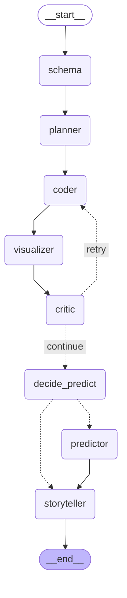

# DataAgent

**An autonomous multi-agent data analyst** — upload any CSV, ask questions in plain English, get SQL queries, interactive charts, ML predictions, and executive-ready reports.

Built with LangGraph + Google Gemini + Streamlit. Seven specialized agents collaborate through a stateful graph with self-correction loops, structured tracing, and a production eval harness.

**[Live demo](https://ahz003-data-agent.streamlit.app)** | [Architecture](#architecture) | [Eval harness](#eval-harness)

<!-- TODO: Replace with a screen recording or screenshot -->
<!--  -->

---

## Headline metrics

| Metric | Value |
|--------|-------|
| **Eval cases** | 18 (12 golden + 6 adversarial chaos); pass rate re-measured after the P0 refactor, see `outputs/eval/report.md` |
| **Eval dimensions** | 8 per case (execution, SQL keywords, top value, row bounds, chart type, narrative keywords, critic confidence, LLM-judge faithfulness) + 3 chaos-only scorers |
| **Test suite** | 132 tests, ~3s, no API calls |
| **Latency** | ~6–12s per question end-to-end (Gemini Flash) |
| **Cost per question** | ~$0.001 (Gemini 2.5 Flash, 15-column dataset) |
| **SQL guard** | sqlglot AST + sqlite3 authorizer + timeout; 40 tests incl. hypothesis property tests |
| **Tracing** | Structured JSONL — per-span token/cost accounting, queryable by run_id |

> *Run `make eval-fast` to reproduce. Results stamped with model + prompt versions for reproducibility.*

---

## Architecture

<!-- GRAPH:BEGIN -->

<!-- GRAPH:END -->

_Generated from the compiled graph by `scripts/export_graph.py`; CI fails if it drifts._

The orchestrator is a **LangGraph StateGraph** with conditional edges. Order: schema → planner → coder → visualizer → critic, then an optional predictor and the storyteller. The critic-to-coder retry loop is bounded (`retry_count` incremented per entry, capped at 3) and short-circuits on terminal errors (quota exhaustion). See the [postmortem](docs/postmortems/2026-04-13_eval_findings.md) for how we found and fixed the infinite-loop bug that this architecture prevented.

### Agent responsibilities

| Agent | What it does | Key design decision |
|-------|-------------|-------------------|
| **Schema** | Profiles columns as dimension / measure / time_axis / identifier | Pure heuristic, no LLM call; reuses the profile the UI computed on upload |
| **Planner** | Classifies question type (descriptive, trend, comparison, prediction, anomaly, segmentation) | Single LLM call; output is a structured `AnalysisPlan` |
| **Coder** | Generates SQL over every table in the workspace (joins via foreign keys), executes it behind a 3-layer guard, self-corrects on errors | Prompt rendered from a `DataSource` (tables, keys, sample values); 3 internal retries; quota errors short-circuit |
| **Visualizer** | Auto-selects chart type and renders Plotly figures | Rule-based on result shape and question keywords, no LLM call |
| **Critic** | Validates statistical rigor — IQR outliers, skewness, sample-size, correlation strength | Scipy-backed (`core/stats.py`), not just heuristics |
| **Predictor** | Holt-Winters forecasting, K-Means clustering, IQR anomaly detection | Runs only when the Planner classifies the question as prediction/segmentation/anomaly |
| **Storyteller** | Generates executive-ready narrative with real-time Gemini streaming | Token-by-token output via `generate_content_stream`; graph node is skippable to avoid 2× cost |

---

## What makes this a senior-level project

This isn't a wrapper around an LLM API. The engineering depth is in the **failure modes, observability, and evaluation infrastructure** — the parts that don't show up in a demo but determine whether the system works in production.

### 1. Structured tracing with cost accounting (`core/tracing.py`)
Every agent node emits a JSONL span with `run_id`, `agent_name`, `duration_ms`, `tokens_in/out`, `cost_usd`, and arbitrary metadata. The UI shows per-question and per-session cost breakdowns. The eval harness stamps prompt versions and model name into every run.

### 2. Production eval harness (`benchmarks/`)
18 golden cases across 3 datasets, scored on 8 dimensions with configurable weights. Includes 6 **adversarial chaos cases** that reward graceful refusal (phantom columns, SQL injection, off-topic questions, impossible filters). Cross-model comparison via `--compare`. Nightly GitHub Action with longitudinal tracking on an orphan `eval-history` branch.

### 3. Versioned prompt registry (`prompts/`)
Prompts live as individual Markdown files with YAML frontmatter (name, version, description). Content-addressed via SHA-256 hash. Every eval run records the exact prompt versions used, so a regression can be tied to a specific prompt change — not just a git sha.

### 4. Three-layer SQL guard (`core/database.py`)
1. **AST validation (sqlglot):** exactly one statement whose root is a SELECT or set operation; any DML/DDL/PRAGMA/ATTACH node anywhere in the tree is rejected. Parsing instead of regex means `REPLACE(...)`, a column named `"update"` and `'it''s; fine'` are no longer false positives.
2. **Engine-level read-only (sqlite3 authorizer):** while a generated query runs, SQLite denies everything except reads, so writes fail in the engine even if layer 1 is bypassed.
3. **Timeout (progress handler):** runaway queries such as unbounded recursive CTEs are interrupted.

Hypothesis property tests check that random SELECTs always pass and random DML is always rejected.

### 5. VCR-style LLM test cassettes (`core/llm_cassette.py`)
Record/replay system for Gemini calls so tests run offline, deterministically, with no API key. Prompt → SHA → stored response. Tests monkey-patch `genai.Client` through the cassette, driving the real agent code path end-to-end with no network.

### 6. Incident response artifact (`docs/postmortems/`)
Full postmortem for the infinite-retry-loop bug caught by the eval harness: timeline, 3-bug root cause analysis, blast radius (2,703 coder spans, full quota burn), 7 regression tests, 5 lessons learned. Plus a [narrative blog post](docs/blog/2026-04-13-the-eval-that-caught-the-infinite-loop.md) suitable for a technical writing sample.

### 7. Scipy-backed statistical critic (`core/stats.py`)
Not "sample size small, be careful" — actual Tukey fences for outlier detection, D'Agostino-Pearson skewness test, Cohen's d for effect size, Pearson r with p-value gating. The critic's warnings have math behind them.

---

## Quick start

### Prerequisites
- Python 3.11+ **or** Docker 24+
- A Google Gemini API key (free at [aistudio.google.com/apikey](https://aistudio.google.com/apikey))

### Local

```bash
git clone https://github.com/AHZ003/data-agent.git
cd data-agent

make install           # uv sync: creates .venv from uv.lock
cp .env.example .env   # set GOOGLE_API_KEY=...

uv run python data/generate_sample_data.py   # optional: 3 sample CSVs
make run
```

### Docker

```bash
cp .env.example .env   # set GOOGLE_API_KEY=...
docker compose up -d --build
# open http://localhost:8501
```

### Makefile targets

| Target | What it does |
|--------|-------------|
| `make install` | Create `.venv` from `uv.lock` |
| `make run` | Start the Streamlit app locally |
| `make test` | Run pytest (132 tests, no API key needed) |
| `make eval-fast` | Run eval harness, rule-based only (needs API key) |
| `make lock` | Re-lock dependencies and regenerate `requirements.txt` |
| `make up` / `make down` | Docker compose up/down |

---

## Eval harness

```bash
# Full eval (12 golden + 6 chaos cases, LLM judge on)
python -m benchmarks.runner

# Rule-based only (no LLM judge, faster)
python -m benchmarks.runner --no-judge

# Single case
python -m benchmarks.runner --case ss_top_region_by_sales

# CI gate: fail if overall score < 0.75
python -m benchmarks.runner --no-judge --fail-under 0.75

# Override model
python -m benchmarks.runner --model gemini-2.5-pro

# Cross-model comparison
python -m benchmarks.runner --compare "gemini-2.5-flash,gemini-2.5-pro"
```

### Scoring dimensions

| Dimension | Weight | What it checks |
|-----------|--------|---------------|
| `execution` | 2.0 | Did the crew run without crashing? |
| `sql_keywords` | 1.0 | Does the SQL contain expected keywords? |
| `top_value` | 1.5 | Is the top-row value correct? |
| `row_count` | 0.5 | Is the result count within bounds? |
| `chart_type` | 0.7 | Is the chart type appropriate? |
| `narrative_keywords` | 1.0 | Does the narrative mention key terms? |
| `confidence` | 0.5 | Is the critic's confidence above threshold? |
| `faithfulness` | 1.5 | LLM-as-judge: is the narrative faithful to the data? |

Chaos cases add three additional scorers: `expect_empty`, `narrative_no_hallucinate`, and `expect_warning`.

### Spider 1.0 (public benchmark)

In addition to the internal golden set, DataAgent can be evaluated against the [Spider](https://yale-lily.github.io/spider) text-to-SQL benchmark — the standard public dataset for comparing text-to-SQL systems. Spider's dev set contains 1,034 questions across 166 databases.

```bash
# One-time setup: downloads Spider dev set + SQLite databases (~95 MB)
make spider-setup

# Run evaluation (first 50 examples by default)
make spider-eval

# Full dev set
python -m benchmarks.spider_eval

# Single database
python -m benchmarks.spider_eval --db-id world_1

# With a different model
python -m benchmarks.spider_eval --model gemini-2.5-pro --limit 100
```

The adapter computes **execution accuracy (EX)**: the fraction of questions where our predicted SQL returns the same result set as the gold SQL. Reports are written to `outputs/spider/`.

---

## Project structure

```
data-agent/
├── app.py                      # Streamlit UI (chat, streaming, trace viewer)
├── config.py                   # Config — prompts loaded from prompts/
├── agents/
│   ├── orchestrator.py         # LangGraph StateGraph + conditional routing
│   ├── schema_agent.py         # Data profiling (no LLM)
│   ├── planner_agent.py        # Question classification
│   ├── coder_agent.py          # Text-to-SQL with quota-aware retry
│   ├── visualizer_agent.py     # Chart type selection + Plotly rendering
│   ├── predictor_agent.py      # Forecasting, clustering, anomaly detection
│   ├── critic_agent.py         # Statistical validation (scipy-backed)
│   └── storyteller_agent.py    # Narrative generation (blocking + streaming)
├── core/
│   ├── database.py             # SQLite engine + 3-layer SQL guard
│   ├── datasource.py           # Multi-table schema (keys, samples) the Coder prompt is built from
│   ├── tracing.py              # Structured JSONL tracing + cost accounting
│   ├── stats.py                # Scipy stat helpers (IQR, skew, Cohen's d, pearsonr)
│   ├── llm_cassette.py         # VCR-style record/replay for offline tests
│   ├── data_loader.py          # CSV/Excel ingestion
│   └── vision.py               # Image-to-table extraction
├── prompts/                    # Versioned prompt files (Markdown + YAML frontmatter)
├── benchmarks/
│   ├── cases.yaml              # 18 golden + chaos eval cases
│   ├── scorers.py              # 8 per-case dimensions + 3 chaos-only scorers
│   └── runner.py               # CLI harness with --model, --compare
├── scripts/export_graph.py     # Regenerates the README graph from the compiled LangGraph
├── models/                     # Pydantic data models
├── db/                         # SQLite persistence layer
├── tests/                      # 132 tests across 15 test files
│   └── cassettes/              # Stored LLM responses for offline replay
├── docs/
│   ├── postmortems/            # Incident write-ups
│   └── blog/                   # Technical blog posts
├── .github/workflows/
│   ├── ci.yml                  # pytest + gated eval on PR
│   └── nightly-eval.yml        # Scheduled full eval + longitudinal tracking
├── pyproject.toml, uv.lock     # Dependencies (requirements.txt is exported from the lock)
├── Dockerfile                  # Non-root, healthcheck
├── docker-compose.yml          # Persistent volumes for DB + traces
└── Makefile                    # run, test, eval-fast, up, down
```

---

## Design tradeoffs

| Decision | Alternative considered | Why I chose this |
|----------|----------------------|-----------------|
| SQLite in-memory DB | DuckDB, direct pandas | SQLite is the simplest correct answer for single-user analytics; the SQL guard layer would work identically with DuckDB |
| LangGraph for orchestration | Raw function calls, CrewAI | LangGraph's conditional edges make the retry loop explicit and inspectable; the graph *is* the architecture diagram |
| Gemini Flash (default) | GPT-4o, Claude | Free tier for development; `--model` flag makes switching trivial for eval comparison |
| Scipy in the critic | Pure LLM-based validation | LLM can't compute a p-value — deterministic stats catch things the LLM would hallucinate confidence about |
| JSONL traces, not OpenTelemetry | OTel + Jaeger | 200 lines of code vs. an infra dependency; the queryable file is enough for a single-user system |
| Prompts as files, not DB | Prompt management platform | Files are diffable in PRs, versioned by git, content-addressed by SHA — no extra infra |

---

## CI/CD

- **On every PR:** `pytest` (132 tests, no API key) + rule-based eval gate (`--fail-under 0.75`, skipped if no API key secret)
- **Nightly:** Full eval with LLM judge, cross-model comparison (optional), artifacts uploaded, summary appended to `eval-history` branch
- **Docker:** Non-root user (UID 1001), healthcheck, persistent volumes

---

## Security

- SQL guard: sqlglot AST allow-list + sqlite3 read-only authorizer + query timeout
- Uploads capped at 50 MB / 500k rows
- `GOOGLE_API_KEY` read from environment only — never committed
- Docker container runs as non-root (UID 1001)
- XSRF protection enabled

---

## Acknowledgments

- **[Claude Code](https://claude.ai/claude-code)** (Anthropic) was used as a development assistant during the implementation of this project.
- **Google Gemini API** powers the agent crew: text-to-SQL, analysis planning, chart selection, narrative generation, image-to-table extraction, and LLM-as-judge eval scoring.
- **[Spider](https://yale-lily.github.io/spider)** (Yale) benchmark used for text-to-SQL evaluation.
- All LLM calls are traced with token counts and estimated cost via the built-in tracing module.
